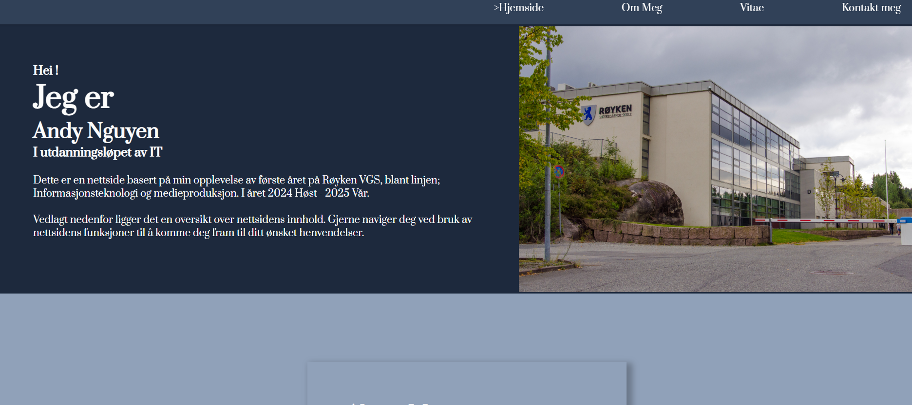

<h1 align="center">Nettside: Åretsoppsummering</h1>

  <h3>
    <a href="https://ande-glitch.github.io/Nettside/index.html">
      Link to project
    </a>
  </h3>

<!-- TABLE OF CONTENTS -->

## Table of Contents

- [Overview](#overview)
- [Built With](#built-with)
- [Features](#features)
- [How to use](#how-to-use)
- [Contact](#contact)

<!-- OVERVIEW -->
## Overview
- En nettside som oppsummerer alt vi har lært denne året blant Informasjonsteknologi og medieproduksjon. 

## Features
- Oversikt over ulike fag/emner
- Navigasjon med header og footer
- Video filer som viser visning av emne

## Utfordringer
- Kreativitet
- Flexbox
- Media Query

## Løsning
- Feilsøking med KI / digitale ressurs
- Oversiktlig blikk over kodestruktur

## Andre ressurs
- KI
- Stack overflow
- W3School

## Contact
- GitHub [Ande-Glitch](https://github.com/Ande-glitch)
- Epost [And Nguyen](mailto:andynuwen@gmail.com)

## Result

